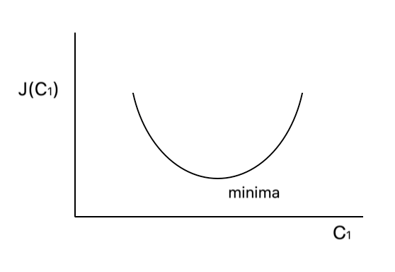
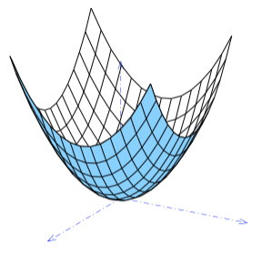
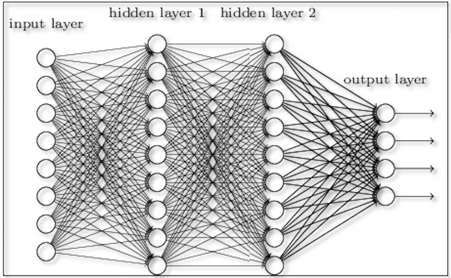

# Machine Learning Notes

Machine learning enables computers to learn without being explicitly programmed.


# Supervised Learning

We present a data-set to the computer where each input/output pair is correct.
Note that the input above can be multi-dimensional and so can the output be too.
Supervised learning can be further broken down into two types:

1. **Regression Problem**: "Continuous-curve" fitting problem where the values corresponding to different inputs are very large in number. Example: number of candies sold per day for a whole year. Here the value "number sold per day" has a very wide range of values and so it would be considered a regression problem.

2. **Classification Problem**: In this case, the number of values corresponding to all the inputs are very few. Example: plotting of whether a person is retired or not against his age. In this case, there are only 2 outcomes: retired or not-retired. For such systems where the output values are easily countable, we identify them as classification problems. Note that the number of possible outcomes need not be limited to 2. Example, we can change the above to plot a person's status as student, working or retired against their age and it would still remain a classification problem because the number of output values is easily countable.


Put more formally, output in a regression problem varies continuosly while output in a classification problem is discrete-valued.


# Unsupervised Learning

In supervised learning, every point in our data-set is complete. It describes very precisely the value for inputs and outputs.
Where as in unsupervised learning, there is no output, only inputs. And its the job of the algorithm to find patterns and structures in that data to group them automatically. An example is to look through a catalog of thousands of images and try to group those images into categories such that similar looking images are grouped together. We only have input here, no proper definition of output is input to the algorithm. The algorithm itself tries to look for patterns for classification.


# Reinforcement Learning

In RL, the machine learning algorithm has a reward function (or a cost function) that it tries to maximize (or minimize). With this reward/cost function, the algorithm is able to evaluate its own success and hence is able to fine-tune its parameters accordingly.

Key Differences from Other Machine Learning Paradigms:  
1. Unlike supervised learning, RL does not have pre-labeled data or explicit instructions. The agent must discover the optimal actions through trial and error.
2. Unlike unsupervised learning, RL aims to learn a specific behavior (maximizing reward), rather than just discovering patterns in the data.

Unlike the other two learning frameworks which work with a static dataset, RL works with a dynamic environment and the goal is not to cluster data or label data, but to find the best sequence of actions that will generate the optimal outcome.

Optimal in this sense means to collect the most reward. It does this by allowing a piece of software called an agent to explore, interact with, and learn from the environment. The agent can take an action which affects the environment, changing its state, and the environment then produces a reward for that action. In using this information, the agent can adjust which action to take in the future. It can learn from this process.

So we can also think of reinforcement learning as a continuous learning which keeps on tuning its model according to latest input/action/reward sequence.

RL does have its own interesting nuances:

1. `Value`: Reward is the instantaneous benefit of being in a specific state, whereas value is the total reward that an agent can expect to collect from that state and onwards into the future. Assessing the value of a state rather than assessing the reward helps the agent choose the action that will collect the most reward over time, rather than a short-term benefit. So for an agent tries to maximize value rather than reward, its possible that it takes a few actions with lesser rewards such that overall reward is maximized. However, there is no guarantee that maximizing value will guarantee maximum reward because environment state can change or model's value calculation might not be perfect. `In RL, we can control this by discounting rewards by a larger amount the further they are in the future.`

2. `Randomizing`: Another critical aspect of reinforcement learning is the trade-off between exploration and exploitation when interacting with the environment. This is the trade between collecting the most rewards that you already know about versus exploring areas of the environment that you haven't visited yet.

3. 


# Squared Error Function

For "continuous curve" problems, the simplest model is to draw a line such that it is as close to all the points as possible.
Mathematically, a line in 2D plane is expressed as:

h(x) = C<sub>0</sub> + C<sub>1</sub>x

So if the known set of values consists of data like [{x<sub>0</sub>, y<sub>0</sub>}, {x<sub>1</sub>, y<sub>1</sub>}...  {x<sub>i</sub>, y<sub>i</sub>}... {x<sub>m</sub>, y<sub>m</sub>}], then the **cost function** is defined as:

J = ∑<sub>i=1:m</sub>(h(x<sub>i</sub>) - y<sub>i</sub>)<sup>2</sup>/2M

And the line is considered a best fit when C<sub>0</sub> and C<sub>1</sub> are chosen to provide a minimum value for the above cost function.


# Contour plots for simplest error function
  
The squared error function `J` is a function of C<sub>0</sub> and C<sub>1</sub>.
Since there are three variables here, `J`, C<sub>0</sub> and C<sub>1</sub>, they are best shown in a 3D graph and then one can select the global minima in that 3D graph to find those C<sub>0</sub> and C<sub>1</sub> for which `J` is the minimum.

A 2D alternative to 3D graph is the [Contour line](https://en.wikipedia.org/wiki/Contour_line). Any contour line on a contour plot is the line joining those set of {C<sub>0</sub>, C<sub>1</sub>} points for which `J` has the same value.  
It can also be thought of as the projection of the 3D graph on a 2D surface.

Naturally, set of C<sub>0</sub> and C<sub>1</sub> for which `J` has large values will be quite high and so contour lines for those will form pretty big circles. And conversely, the set of C<sub>0</sub> and C<sub>1</sub> for which `J` has low values will be quite low and so contour lines for those will be smaller circles.

So it is easy to postulate that the best curve-fitting line is obtained by those C<sub>0</sub> and C<sub>1</sub> for which the contour line forms the smallest circle.


# Nature of cost function `J`

As can be seen above, `J` is a function of C<sub>0</sub> and C<sub>1</sub>.  
Technically it is also a function of y<sub>i</sub> and M etc kind of variables but those will not change once a problem is specified.
So for a specific problem, `J` is a function of C<sub>0</sub> and C<sub>1</sub> and the goal of machine learning algorithm is to find C<sub>0</sub> and C<sub>1</sub> such that `J` is minimized.

To understand how to find such C<sub>0</sub> and C<sub>1</sub>, let us consider for a moment that C<sub>0</sub> is zero and does not change.
Thus, our cost function `J` is now just a function of C<sub>1</sub>. Graphically, this gives us a line passing through 0,0 and whose slope C<sub>1</sub> needs to be found such that its distance from all the given points {x<sub>i</sub>, y<sub>i</sub>} is minimum (i.e. the squared error function has the least value). Obviously, there will be just one such slope C<sub>1</sub> (proof not provided here but it is pretty intuitive). So if we plot the graph of J as a function of C<sub>1</sub>, it will be a U-shaped curve like this:



When J is a function of both C<sub>0</sub> and C<sub>1</sub>, the situation is similar, just that the same U-shaped curve exists in two dimensions and looks somewhat similar to:




# Gradient Descent Algorithm

One of the algorithm to find C<sub>0</sub> and C<sub>1</sub> is the gradient descent algorithm. Again to start simple, let us consider the case when C<sub>0</sub> is zero and does not change. This leaves us with just C<sub>1</sub> and a single U-shaped curve in 2D shown above.

The gradient descent algorithm says that we can start with any value of C<sub>1</sub> and can calculate the next value of C<sub>1</sub> by the following function:
C<sub>1</sub> = C<sub>1</sub> - (α Δ)

Where **α** is a constant called the **step-size** (or the **learning rate**) and determines how fast we converge to our solution.  
And **Δ** is the slope of J at C<sub>1</sub>

So basically, all we are doing here is subtracting a fraction of J's slope from C<sub>1</sub> to arrive at the next value of C<sub>1</sub>.  
The step-size **α** cannot be too high otherwise the convergence will never happen and the gradient descent algorithm will just keep overshooting the minima its planning to achieve. If **α** is too low, then the convergence will happen too slowly, thus wasting computation cycles.

With both C<sub>0</sub> and C<sub>1</sub>, the same thing applies:  
C<sub>0</sub> = C<sub>0</sub> - (α Δ<sub>0</sub>)  
C<sub>1</sub> = C<sub>1</sub> - (α Δ<sub>1</sub>)  

The important thing to note here is that Δ<sub>0</sub> and Δ<sub>1</sub> are the partial derivates of the function J(C<sub>0</sub>, C<sub>1</sub>) and in every iteration, they should be calculated before doing the above two computations i.e. following should not be done:  
C<sub>0</sub> = C<sub>0</sub> - (α Δ<sub>0</sub>)  
Update J(C<sub>0</sub>, C<sub>1</sub>) with new value of C<sub>0</sub>  
C<sub>1</sub> = C<sub>1</sub> - (α Δ<sub>1</sub>)  

Because with the above intermediate updation of `J`, the convergence is somewhat unexpected and the algorithm does not fall under the gradient descent algorithm category anymore.

# Calculation of the slope w.r.t x<sub>0</sub>, x<sub>1</sub> .. x<sub>n</sub>

Skipping the derivation part, the formula for slope Δ<sub>j</sub> is:

Δ<sub>j</sub> = ∑<sub>i=1:m</sub>((h<sub>i</sub> - y<sub>i</sub>)\*(x<sub>i,j</sub>))/m  
Substituting value of h<sub>i</sub> =  
Δ<sub>j</sub> = ∑<sub>i=1:m</sub>((X<sub>i</sub><sup>T</sup>C - y<sub>i</sub>)\*(x<sub>i,j</sub>))/m  

In the above:  
X is a (m)<sub>x</sub>(n+1) matrix (m is number of samples, n is number of features),  
C is a (n+1)<sub>x</sub>(1) matrix and  
Y is a (n+1)<sub>x</sub>(1) matrix


# Matrix Inverse

Just as in the non-matrix world, most numbers have an inverse such that AA<sup>-1</sup> = 1, similarly in the matrix world, there exists matrix inverse M<sup>-1</sup> such that MM<sup>-1</sup> = I (i.e. the identity matrix).

**Note**: Just like 0 does not have an inverse, every matrix does not have an inverse. Example:
```
  --   --
 | 0   0 |
 | 0   0 |
  --   --
```


# Matrix Transpose

Transpose matrix of any matrix is simply the matrix formed by converting each row of the original matrix into a column of the transpose matrix.
So if original matrix A is:
```
  --   --
 | 1   2 |
 | 3   4 |
 | 5   6 |
  --   --
```

Then A<sup>T</sup> would be:
```
  --      --
 | 1   3  5 |
 | 2   4  6 |
  --      --
```

# Multiple Linear Regression
In most real world situations, the cases are more complex than the simple **C<sub>0</sub> + C<sub>1</sub>x** situation.
A very natural extension of the above case is when:

h<sub>c</sub>(x) = C<sub>0</sub> + C<sub>1</sub>x<sub>1</sub> + C<sub>2</sub>x<sub>2</sub> ... + C<sub>n</sub>x<sub>n</sub>

Here, we can assume that x<sub>0</sub> is always 1.

Thus, in matrix notation, this can be presented as:

```
        --  
      | C0  |
      | C1  |
C =   | C2  |
        ...
      | Cn  |
        --  

        --  
      | x0  |
      | x1  |
X =   | x2  |
        ...
      | xn  |
        --  
```
and this gives H = C<sup>T</sup>X

Note that x<sub>0</sub>, x<sub>1</sub> ... x<sub>n</sub> are also called the N+1 **features** of the multiple linear regression


# Gradient Descent for multiple linear regression

Recall from the above that the squared error function J is defined as:

J = ∑<sub>i=1:m</sub>(h<sub>i</sub> - y<sub>i</sub>)<sup>2</sup>/2M

This does not change for the multiple linear regression case. Just becomes a little more verbose as:

J(C<sub>0</sub>, C<sub>1</sub> ... C<sub>n</sub>) = ∑<sub>i=1:m</sub>(h<sub>i</sub> - y<sub>i</sub>)<sup>2</sup>/2M


The method to converge on the most desirable value set of C<sub>0</sub>, C<sub>1</sub> ... C<sub>n</sub> also remains the same:

C0 = C0 - (α Δ0)  
C1 = C1 - (α Δ1)  
...  
Cn = Cn - (α Δn)  


# Feature Scaling

If the features x<sub>0</sub>, x<sub>1</sub> ... x<sub>n</sub> of multiple linear regression (MLR) vary widely from each other in their range of values, then you can imagine that the contour-plots for them would be very skewed. Think about the contour plot for just one feature x<sub>1</sub> whose H depends only on C<sub>0</sub> and C<sub>1</sub>. If range of C<sub>0</sub> is from 0 to 10 while range of C<sub>1</sub> is from 0 to 10000, then the contour plot between the two will skew very widely in the direction of C<sub>1</sub>.

It would be difficult to apply gradient descent in such a case because the gradient descent will keep overshooting the global minima for low-range C<sub>0</sub>. To solve this, we can divide the C<sub>0</sub>, C<sub>1</sub> by their ranges to get them both in the range `[-1, 1]`. When both come in the same range, their contour plot will look like a perfect circle and hence much easier to converge.

This division of C<sub>0</sub>, C<sub>1</sub> ... C<sub>n</sub> with their respective ranges is called `feature scaling`.

In practice, we do not just divide them with their respective ranges since its possible that one feature varies from 10,000 to 10,0001 while other varies from 0 to 10. If we just divide them by their ranges, it would be no good. So we apply the following formula:

x<sub>i</sub> = (x<sub>i</sub> - avg(x)) / (x<sub>max</sub> - x<sub>min</sub>)


# Polynomial Regression

It is not always possible to have a linear equation to represent the curve that will minimize the cost function i.e. fit the most number of points.
It could be a polynomial expression too like:

h(x) = C<sub>0</sub> + C<sub>1</sub>x + C<sub>2</sub>x<sup>2</sup> + C<sub>3</sub>x<sup>3</sup> ... C<sub>n</sub>x<sup>n</sup>

It turns out that we can easily reduce the above to a linear regression problem by redefining the features.  
For example, we can redefine as:  
z<sub>0</sub> = x<sup>0</sup>  
z<sub>1</sub> = x<sup>1</sup>  
z<sub>2</sub> = x<sup>2</sup>  
...  
z<sub>n</sub> = x<sup>n</sup>  

Thus, our curve h(x) becomes:  
h(x) = C<sub>0</sub> + C<sub>1</sub>z + C<sub>2</sub>z<sub>2</sub> + C<sub>3</sub>z<sub>3</sub> ... C<sub>n</sub>z<sub>n</sub>

which is same as linear regression ! So we solve for this linear regression and then transform back the results to the original form.


# Normal Equation : Solving for C by a formula

The below function J(C<sub>1</sub>) is minimum when its slope dJ/dC<sub>1</sub> = 0.  
This fact becomes obvious when we realize that only when slope=0, J(C<sub>1</sub>) changes direction from decreasing to increasing. So the minimum has to be when dJ/dC<sub>1</sub> = 0


The same fact applies when J is a function of C<sub>0</sub>, C<sub>1</sub> ... C<sub>n</sub> except that dJ/dC<sub>1</sub> becomes a [partial derivative](https://en.wikipedia.org/wiki/Partial_derivative). So `J` achieves its lowest value when we solve all the following equations:  

  dJ/dC<sub>0</sub> = 0  
  dJ/dC<sub>1</sub> = 0  
  dJ/dC<sub>2</sub> = 0  
  ...  
  dJ/dC<sub>n</sub> = 0  

(Note that dJ/dC<sub>i</sub> denotes the partial derivative of J with respect to C<sub>i</sub>)

There are n+1 equations above and n+1 variables to solve.  
Solution for this kind of setup is given by the formula: C<sub>ideal</sub> = (X<sup>T</sup>X)<sup>-1</sup>X<sup>T</sup>y

where:  

`X` is m-by-n+1 input matrix  
`Y` is m-by-1 output matrix  
`m` is the number of data points we have.  
`n` is the number of features present in the the data.

Example: If we have the selling-price of a cloth as a function of n=3 features: size, cost price and tax with m=4 data points as follows:

|C<sub>1</sub>=size|C<sub>2</sub>=cost-price|C<sub>3</sub>=tax|y=selling-price|
|----|----------|---|-------------|
| 10 | 100      | 10| 140         |
| 11 | 120      | 15| 160         |
| 10 | 120      | 11| 155         |
| 14 | 140      | 14| 200         |

then our input matrix X<sub>m,n+1</sub> (with m = 4, n = 3) would be:
```
  --           --
| 1  10  100  10 |
| 1  11  120  15 |
| 1  10  120  11 |
| 1  14  140  14 |
 --            --
```
Here first column denotes C<sub>0</sub> which is always 1.

And y<sub>m,1</sub> would be:
```
 -- --
| 140 |
| 160 |
| 155 |
| 200 |
 -- --
 ```
 
Compared to gradient descent, this method of direct computation is good because:
1. There is no iteration involved and we get the best value of C(n,1) in one shot.
2. No need to find out a right value of step-size **α**
3. No need to do feature scaling

However, its only disadvantage is that the matrix operations involved here are of the O(n<sup>3</sup>) which makes it very costly when n is more than 10,000. At that point, it is sometimes advisable to fall back to gradient descent (with order as O(kn<sup>2</sup>)) to speed up calculations.


**Quick dimension check for (X<sup>T</sup>X)<sup>-1</sup>X<sup>T</sup>y**

X is an (m, n+1) matrix.  
So X<sup>T</sup> would be (n+1, m) matrix.  
X<sup>T</sup>X would therefore be (n+1, m)(m, n+1) = (n+1, n+1) matrix.  
(X<sup>T</sup>X)<sup>-1</sup> would also be same (n+1, n+1) matrix.  
(X<sup>T</sup>X)<sup>-1</sup>X<sup>T</sup> = (n+1, n+1)(n+1, m) = (n+1, m) matrix.  
And the final expression (X<sup>T</sup>X)<sup>-1</sup>X<sup>T</sup>y = (n+1, m)(m, 1) = (n+1, 1) matrix.  
(n+1, 1) matrix thus obtained gives us the ideal values of C<sub>0</sub>, C<sub>1</sub> ... C<sub>n</sub> that we need to best-fit the linear equation for the given data.


# Logistic Regression - Classification Algorithm

Most simplest form of a classfication problem is the binary one where the outcome is always one of the two values only.
Like algorithm to predict whether it is dark or not at 6:00 pm with input as day of the year.
Or algorithm to predict whether a car will have accident or not with input as the speed of the car.

In such algorithms, the outcome has just one of the two values and several data-points are provided for the algorithm for curve-fitting.
If we apply linear regression to such cases and draw a line or a polynomial, it is very highly probably that the h(x) will have values beyond the two we expect.
One way is to scale down the output by a suitable factor to limit the range of h(x) but doing so is difficult when the range of h(x) is quite high like -INF to +INF. Secondly, if the inputs for one kind of output are much more than the inputs for other kind of output, then the resulting curve will be more tuned to fit the larger group.

To overcome these problems, a new kind of h(x) is proposed for classification type problems.
This h(x) is called [logistic regression function](https://ml-cheatsheet.readthedocs.io/en/latest/logistic_regression.html) and is of the form:  
1 / (1 + e<sup>-z</sup>)  
This curve shows saturation at +1 and -1 values and it only takes values between -1 and +1.


To limit the output of this function to just two values, we round the output such that values below 0.5 are taken as 1 and values below 0.5 are taken as 0.
So the transition occurs at 0.5.

=> 0.5 = 1 / (1 + e<sup>-z</sup>)  
=> 1 + e<sup>-z</sup> = 2  
=> e<sup>-z</sup> = 1
=> z = 0

Let us also try with z = 5 and z = -5

z=5  
=> 1 / (1 + e<sup>-1*5</sup>)  
=> 1 / (1 + e<sup>-5</sup>)  
=> 1 / (1 + 0.0000xyz)  
~= 1  
i.e. the plot saturates to 1 beyond z=5

z=-5
=> 1 / (1 + e<sup>-1*-5</sup>)  
=> 1 / (1 + e<sup>5</sup>)  
=> 1 / (1 + some-large-value)  
~= 0  
i.e. the plot saturates to 0 beyond z=-5


For the machine learning algorithms, the `z` is replaced by C<sup>T</sup>X.  
Note that 1 / (1 + e<sup>-z</sup>) is also called the `sigmoid` function and so we can represent the hypothesis `h` as:  
h(x) = sigmoid(C<sup>T</sup>X)  


# Cost function for Logistic Regression

Next step is to find out a cost function which we will try to minimize so that our chosen `C` best fits the curve.
We cannot have the same cost function as linear regression because with h(x) = 1 / (1 + e<sup>-z</sup>) with z = C<sup>T</sup>X, the linear regression's cost function tends to be wavy with several local minima. So some other cost function needs to be used.

Consider log(v):

|power of b|v|log<sub>b</sub>(v)|
|---|---|------|
| b<sup>-2</sup> | 1/b<sup>2</sup> | -2 |
| b<sup>-1</sup> | 1/b | -1 |
| b<sup>0</sup> | 1 | 0 |
| b<sup>1</sup> | b | 1 |
| b<sup>2</sup> | b<sup>2</sup> | 2 |
| b<sup>-INF</sup> | 0 | -INF |

Graphically, this looks as follows:


And -log(v) looks as follows:


And now consider the following two graphs:

|-log(x)|-log(1-x)|
|-------|---------|
|||


Thus, if we segregate our input data into two parts, one where y=0 and one where y=1, then we can use `-log(h)` as a cost function for those inputs where y=1 because the cost is 0 when h=1 and penalty of h being 0 is INF i.e. quite high.  
Similarly we can use `-log(1-h)` as a cost function for those inputs where y=0 because the cost is 0 when h=0 and the penalty of h being 1 is INF (again quit high).

So we can define as our cost function as:  
J = ∑<sub>i=1:m</sub>(Cost(C,h,y))/m  
Cost(C,h,y) is function of:  
 - Constants C<sub>0</sub>, C<sub>1</sub> ... C<sub>n</sub>  
 - Hypothesis h (i.e. the curve we plan to build)
 - And y, the output

And Cost(C,h,y) is defined as:  
```
  if (y == 1) {
     Cost = -log(h)
  } else {
     Cost = -log(1-h)
  }
```

Note that `J` is the final cost function while Cost<sub>i</sub>(C,h,y) is cost for each input tuple {x<sub>i</sub>, y<sub>i</sub>}.

The above if condition can be written more simply as:

```
Cost = -(y*log(h) + (1-y)*log(1-h))
```
Its easy to verify that for y=0,1 values, the above equation does collapse to the if-statement given before it.

Using this "simpler" format, the final cost function J can be written as:

J = -∑<sub>i=1:m</sub>(y<sub>i</sub>\*log(h<sub>i</sub>) + (1-y<sub>i</sub>)\*log(1-h<sub>i</sub>))/m

All we need to do now is to minimize this cost function and get the Constants C<sub>0</sub>, C<sub>1</sub> ... C<sub>n</sub> which will best fit our curve.
It turns out that the final equation for the gradient descent of this is also the same as that for linear regression:

Iterate n-times and adjust C<sub>0</sub>, C<sub>1</sub> ... C<sub>n</sub> in each iteration as:

C<sub>0</sub> = C<sub>0</sub> - (α Δ<sub>0</sub>)  
C<sub>1</sub> = C<sub>1</sub> - (α Δ<sub>1</sub>)  
...  
C<sub>n</sub> = C<sub>n</sub> - (α Δ<sub>n</sub>)  

where Δ<sub>j</sub> is:

Δ<sub>j</sub> = ∑<sub>i=1:m</sub>((h<sub>i</sub> - y<sub>i</sub>)\*(x<sub>i,j</sub>))/m 

The above is exactly the same as linear regression with just one change that the hypothesis function `h` is different in logistic regression.


# Minimizing J in practice
More sophisticated algorithms are available in both Matlab and Octave that automatically change the learning rate `α` and compute the solution much faster. Some such algorithms are:
* Conjugate gradient
* BFGS
* L-BFGS


# Overfitting problem with too many features or with higher level polynomials

When the number of inputs (also called features) are too many or we use very high level polynomials to fit the curve too exactly, then it is possible that the curve just fits too nicely such that it does a great job of lowering the cost function for the given set of data, but predicts very badly for any new set of inputs.

This overfitting can be reduced by having a `model selection algorithm` that automatically throws away some of the features it thinks are not useful.

Anohter algorithm to fix this problem is called `regularization` where in the value of each constant is reduced somewhat to make them less impactful.


# Regularization

We cannot reduce all the C<sub>i=1:n</sub> by the same value because that will not be a proportionate change and will give us a cost function that is not minimum.
So we have to include the C<sub>i=1:n</sub> in the cost function itself somehow such that it also plays a role in the gradient descent equations.
One way to do that is to change the cost function to:

J = (∑<sub>i=1:m</sub>(h<sub>i</sub> - y<sub>i</sub>)<sup>2</sup> + λ\*∑<sub>i=1:n</sub>C<sub>i</sub><sup>2</sup>) / 2 M

Here λ is called the `regularization factor`. If its too high, then all C<sub>i</sub>s will be too low and the curve will essentially be a straight line.
If its too low, then all C<sub>i</sub>s will be too high and the curve will become very overfitted.

The partial derivative equations of gradient descent thus changes accordingly as:

C<sub>j</sub> = C<sub>j</sub> -  α (∑<sub>i=1:m</sub>((h<sub>i</sub> - y<sub>i</sub>)\*(x<sub>i,j</sub>)) + λ\*C<sub>j</sub>)/m  
i.e. C<sub>j</sub> = C<sub>j</sub> (1 - αλ/m) - α ∑<sub>i=1:m</sub>((h<sub>i</sub> - y<sub>i</sub>)\*(x<sub>i,j</sub>))/m  

So the last term remains as such in the gradient descent of linear regression.
Only change introduced is that in every iteration C<sub>j</sub> gets reduced even more by the factor (1 - αλ/m).  
In practice this factor is kept quite small like .99  

Similarly, the normal equation that directly solves the linear regression changes from:  
(X<sup>T</sup>X)<sup>-1</sup>X<sup>T</sup>y  
to:  
(X<sup>T</sup>X + λI<sub>n+1</sub>)<sup>-1</sup>X<sup>T</sup>y  

where I<sub>n+1</sub> is the [identity matrix](https://en.wikipedia.org/wiki/Identity_matrix).

Same thing follows for the logistic regression too:

We add the term λ\* ∑<sub>i=1:n</sub>C<sub>i</sub><sup>2</sup> / 2 M to the cost function J  
And the partial derivatives reduce by C<sub>j</sub> (1 - αλ/m) just like linear regression above.


# Neural Networks

Logistic regression cannot form complex hypotheses as it is only a linear classifier.
If we add more features to it or make it polynomial, then it becomes very costly computation wise.

This is where neural networks come into play. Here is an example neural network:  
  

Input layer is the list of features X<sub>i=1:n</sub> and the output layer is a list of the classification values Y.
All the other hidden layers are logistic regressions of their previous layers.
So in the above example:  
hidden1 = sigmoid(C<sub>1</sub><sup>T</sup>X)  
hidden2 = sigmoid(C<sub>2</sub><sup>T</sup>hidden1)  
output = sigmoid(C<sub>3</sub><sup>T</sup>hidden2)  

The goal of neural network is to compute the C<sub>1</sub>, C<sub>2</sub> ... C<sub>n</sub> such that the output Y is classfied as accurately as possible.

So neural network applies the logistic regression on multiple layers to improve its prediction power.


# Formulating Neural Networks: Back-propogation algorithm

We can introduce some more expressions into the above equations so that it would be easier to formulate them later:

Let a<sup>i</sup> denote the output at layer `i`. Then we can say the following:  
a<sup>(1)</sup> = x (i.e. the input layer itself)  
a<sup>(2)</sup> = g(C<sup>(1)</sup>a<sup>(1)</sup>)  
a<sup>(3)</sup> = g(C<sup>(2)</sup>a<sup>(2)</sup>)  
...  
a<sup>(l)</sup> = g(C<sup>(l-1)</sup>a<sup>(l-1)</sup>)  
h = a<sup>(l)</sup>  
l = number of layers in the neural network  

We also name the expression inside `g()` as `z` so that:  
z<sup>(i)</sup> = C<sup>(i-1)</sup>a<sup>(i-1)</sup>  
a<sup>(i)</sup> = g(z<sup>(i)</sup>)  

We can define the error at output as:  
δ = a<sup>(l)</sup> - y  

In the back-propogation algorithm, we calculate δ for each layer, beginning with the last year as:  
δ<sup>l</sup> = a<sup>(l)</sup> - y  
δ<sup>i</sup> = (C<sup>(i)</sup>)<sup>T</sup>δ<sup>i+1</sup> .\* g'(z<sup>(i)</sup>) for all i < l   

here `g'` is the [derivative of sigmoid function](https://math.stackexchange.com/questions/78575/derivative-of-sigmoid-function-sigma-x-frac11e-x) where g(z) = 1/(1+e<sup>-z</sup>)  
And this comes out to be g'(z) = g(z) .\* (1-g(z))  
This is interesting because derivate of sigmoid function involves the sigmoid function itself !  
(**Note**: The above is not z .\* (1-z), a common misunderstanding. It is g(z) .\* (1-g(z))).


Substituting g'(z<sup>(i)</sup>) and taking care of transpose during multiplication:  
δ<sup>i</sup> = δ<sup>i+1</sup> \* C<sup>(i)</sup>(:,2:end) .* a<sup>(i)</sup> .* (1-a<sup>(i)</sup>)  


Ignoring some complex math, we can arrive at the conclusion that the derivate of the cost function for above neural network case is:  
Δ<sup>l</sup> = a<sup>l</sup>δ<sup>l+1</sup>

We just loop over the input set, calculating Δ<sup>l</sup> for each input and then sum them together to form the combined derivative for all the inputs.


# Bias vs Variance

A solution is said to have a high bias if its **underfitting** i.e. the error is quite high even for the most optimal values of `C`.
Conversely, a solution is said to have high variance if its **overfitting** i.e. the error is quite low for the given training set but the prediction-error is quite high.


# Deciding what parameters to change to avoid both bias and variance
The Cost function `J` depends not only `C`. It also depends upon:  

1. Number of training examples `m`
2. Regularization factor `λ`
3. Number of features
4. Degree of the polynomial whose curve we are trying to fit.

It is generally a good idea to divide your training set into 3 parts (generally 60%, 20% and 20%):  
1. **Training Set** - Used to train the set as usual for calculating the best `C`
2. **Validation Set** - Used to calculate the cost for different values of the above 4 parameters and select the best parameter for those.
3. **Test Set** - After training and validation has been done, this test-set is used to calculate the cost and see how the above 2 really performed, like a test for all the optimizations done.


|Param|Causes High Bias?|Causes High Variance?|
|-----|-----------------|---------------------|
|High number of training examples `m`|No|No|
|Higher regularization factor|Yes|No|
|High number of features|Yes|No|
|High degree of the polynomial|No|Yes|

|Param|Fixes High Bias?|Fixes High Variance?|
|-----|----------------|--------------------|
|Increasing number of training examples `m`|Possibly|Yes|
|Increasing regularization factor|No|Yes|
|Increasing number of features|No|Yes|
|Increasing degree of the polynomial|Yes|No|

So if the machine learning algorithm is not able to predict very accurately, then we should first determine whether its bias is high or its variance. Then we can look at the above tables to determine what inputs we can change to have a better algorithm.


# Precision, Recall and Accuracy

Consider a prediction algorithm that just outputs a 1 or 0.  
One way to represent its accuracy is to draw a matrix like the following:  

```
                Actual Outcome
 Predcited    P=1,A=1     P=1,A=0    
 Outcome      P=0,A=1     P=0,A=0
```
Above 4 cases are known as:
```
                            Actual Outcome
 Predcited    TP: True Positive       FP: False Positive
 Outcome      FN: False Negative      TN: True Negative
```

**Precision** is then defined as:  
```
P = TP / (TP + FP)  
```
i.e. precision is a measure of how accurate was the prediction for cases where we predicted 1.  
In simpler words, high precision means lesser **over-prediction**.

**Recall** is defined as:  
```
R = TP / (TP + FN)
```
i.e. recall is a measure of how accurate was the prediction for cases where the value was actually 1.  
In simpler words, high recall means lesser **misses**.

And **Accuracy** is defined as:
```
A = (TP + TN)/(total examples)
```

If both precision and recall are close to 1, then the algorithm is said to be good.


# F Score
Precision and Recall are great indicators of how good a particular learning algorithm's prediction is but they often run against each other i.e. if you optimize one, then it generally happens at the cost of the other. Given this problem, it becomes hard to compare the performance of many algorithms. Example is algorithm with P=0.6 and R=0.3 better than another algorithm with P=0.5 and R=0.4 ?

What we need is a single parameter instead of two for comparing algorithms against one another.

Some common ways to convert P and R into one param are:
1. **Average**: Not a very good indicator since you this will make 0.9,0.1 as good as 0.5,0.5 where as the former is clearly bad because such low R means a very low ability to output true for all the cases where the output should have been true really.
2. **Sum**: This suffers from the same problem as average.
3. **Product**: This is just the opposite of sum/average. While sum/avg formulas did not penalize a very low P or R, product formula penalizes very low values very heavily.

So a simple solution is to use both average and product in such a way that they balance each other.

This simple solution is called the **F Score** and is defined as:  
```
2 PR / (P + R)
```
i.e. product divided by average.  
The maximum value of this score is when both P and R are 1:
```
2*1*1 / (1 + 1) = 2/2 = 1
```
|P|R|F|
|-|-|-|
|0.9|0.1|0.18|
|0.8|0.2|0.32|
|0.7|0.3|0.42|
|0.6|0.4|0.48|
|0.5|0.5|0.5|
|0.6|0.6|0.6|
|0.4|0.4|0.4|

This helps the decision making process somewhat by having to look at only 1 parameter. Even this is far from perfect though since different situations might call for different trade-offs in P and R such that 0.7,0.3 might be actually considered better than 0.5,0.5 in some cases.


# Unsupervising Learning

These algorithms are the ones where Y is absent. That is there is no user labeling of the output.  
And the ML algorithm has to identify the classification on its own.

# K-Means Algorithm

K-Means algorithm is a classification algorithm that attempts to group similar data together.  
It performs this feat as follows:

1. Randomly initialize few points in the dataset called the **centroids**.
2. For each example in the dataset, calculate its distance from all the centroids.
3. Assign every example to its nearest centroid using the above logic.
4. Calculate new position of each centroid as **the average of the examples that got assigned to it**.
5. Re-run (2) to (4) until we have an acceptable accuracy in the assignment of examples to centroids.
6. One way to calculate accuracy of assignment is to calculae how many examples move from one centroid to other in each run. If very few points move on every subsequent run of the algorithm, then we have achieved the desired accuracy.

Main variables in this algorithm are:

- K : number of centroids
- Training set: x<sup>1</sup>, x<sup>2</sup> ... x<sup>m</sup>
 
Where x<sup>i</sup> ∈ ℝ<sup>n</sup> (i.e. where each x<sup>i</sup> is a n-dimensional feature vector)

# Cost function of K-Means

J = (1/m) * ∑<sub>i=1:m</sub>(x<sup>i</sup> - μ<sub>i</sub>)<sup>2</sup>

Where:  
- m : number of examples  
- μ<sub>i</sub> : centroid to which x<sup>i</sup> is currently assigned  


# Dimensionality Reduction

1. Reduce number of features to speed up the computation.
2. Replace highly correlated features with main features.
3. Visualization of data with lesser features is also easier.

# Principal Components Analysis

This is the most popular dimensionality reduction algorithm.  
For example, if we want to reduce 2 features to 1 feature, we can do this by drawing a line on the plane of 2 features such that:
1. Each example creates its projection on this line.
2. The average distance of these projections on our line is minimum.

The projections on the line then becomes a single-dimensional representation of our 2-feature plane.  
Similarly, a 3-D feature volume can be represented by 2 features if we consider the projections of those 3-D examples onto a 2-D plane.

Its recommended to do **data scaling** on the inputs before PCA.  
1. Find mean of all the examples μ (ℝ<sup>n</sup> vector)
2. Scale each example as: x<sub>j</sub><sup>(i)</sup> = (x<sub>j</sub><sup>(i)</sup> - μ<sub>j</sub>) / s<sub>j</sub>  
Here 1 < j < n where n is the number of input features.  
And 1 < i < m  where m is the number of examples.  
s<sub>j</sub> = range of x<sub>j</sub> (i.e. max<sub>1:m</sub>(x<sub>j</sub>) - min<sub>1:m</sub>(x<sub>j</sub>))

Beyond this, we perform some mathematical transformations to reduce the N features to k features.  
Those transformations are a bit complex to understand but very easy to do with libraries like Octave.

Once features are reduced, you can tune your algorithm for it and then reconstruct back the answer to original features by doing again some mathematical transformations.

# Anomaly Detection

We draw a model of the input examples and any example that is not within an acceptable range of the model is considered an anomaly.  
**Gaussian Distribution** is a very well known model that is used to model examples for anomaly detection.  
Its a bell shaped curve whose equation is:  

p(x) = e<sup>-0.5*((x-μ)/σ)^2</sup>/(σ.sqrt(2π)  

Where μ is the mean of all input examples.  
And σ<sup>2</sup> is the standard deviation of all examples i.e. σ<sup>2</sup> = (1/m) * ∑<sub>i=1:m</sub>(x<sup>i</sup> - μ)<sup>2</sup>  
The p(x) calculates the probabilty of `x` **not** being an anomaly.  
So if p(x) is less than a pre-defined probability ϵ, then that input x is considered anomalous.  
We calculate μ, σ and p for every feature x<sub>j</sub> and then find p(x) for all features of a new input.  
If for any feature, p(x) is less than ϵ, then x is anomalous.  


# What if the features are not distributed like a Gaussian curve?

We can try to trasnform the non-Gaussian features into Gaussian by applying one of the below transforms:  
1. log(x)
2. log(x+1)
3. log(x+c) where c is some constant
4. x<sup>1/2</sup>
5. x<sup>1/3</sup>

# Multivariate Gaussian Distribution

Regular Gaussiana Distribution independently analyzes each feature to see if its anomalous.  
This is sometimes not desirable and we want to analyze all features together.  
This can be done by the [Multivariate Gaussian Distribution](http://cs229.stanford.edu/section/gaussians.pdf)

